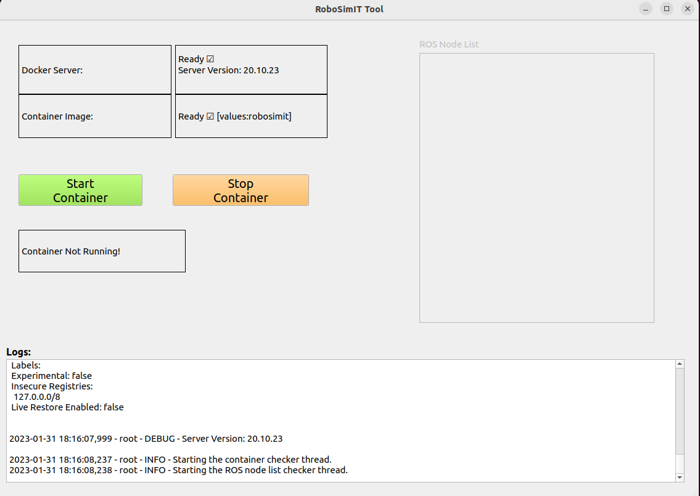
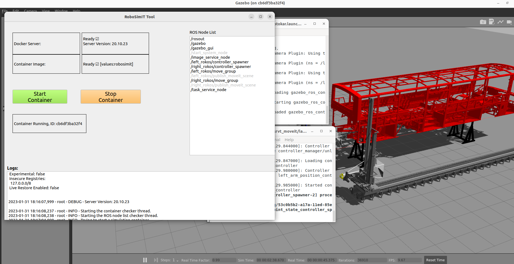

## RoboSimIT
Robot Simulation Container Management and V&V Tool

## Stack
- Ubuntu 20.04.2 LTS (Host and guest)
- NVIDIA Driver (465, 510)
- ROS Noetic Desktop Full
- Gazebo 11
- MoveIt (https://moveit.ros.org/)
- SMACH (http://wiki.ros.org/smach)
- SRVT Package from IMTGD (https://github.com/inomuh)
- PyQt5

## Building the Docker Image
```
git clone https://github.com/techy-digital/robosimit.git
cd robosimit
docker build -t valu3s:robosimit .
```
- You need to get SRVT package and copy it under `simulation` directory. Your Gazebo world files should also be located in `simulation/srvt_ros/model` directory.

## Running a single container
```
sh start_container.sh
```

## Tested On
- Xeon E3-1270 CPU
- NVIDIA Quadro P2000 GPU
- 64 GB RAM
- Ubuntu 20.04.2 LTS

## Screenshots

